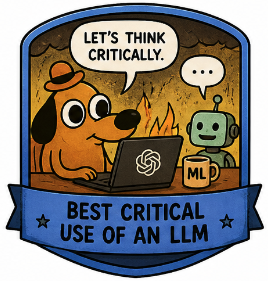

<p align="center">
  
</p>

# Group Project: _Can AI Help You Build a Better Machine Learning Model?_

**Course:** ICT 3.3 Machine Learning and Data Mining  
**Date:** May 2026  

In this group project, you will build a small machine learning pipeline and critically test whether an AI assistant can improve one part of your work.

The AI assistant may help you think, compare, or debug, but it must **not replace your own modelling decisions**.


| Item | Requirement |
|---|---|
| Group size | 2–4 students |
| Output | 5-minute presentation |
| Main deliverable | Small ML pipeline + critical AI assistant use |
| Required model | At least one baseline ML model |
| Required analysis | Evaluation + 3 model mistakes |

---

## Main Requirements

This is a **one-week project**, so the goal is not to build a perfect or advanced ML system.

A successful project should include:

- one dataset

- one clear ML task

- one simple baseline model

- one small improvement

- one fair evaluation

- three concrete model mistakes

- one short reflection on whether the AI assistant helped

You should not try to test many models, many datasets, or many LLM prompts. Depth and clarity are more important than complexity.

The LLM component should take only a small part of the project. Use it to support **one** controlled step, such as suggesting one feature or helping explain model errors.

Do not spend more than **20–30%** of your time on the LLM component.

---

## Dataset Menu

You may choose your own dataset, but the following options are beginner-friendly and suitable for bachelor-level ML projects.

Some Kaggle datasets may require a free [Kaggle](https://www.kaggle.com/) account.

| Theme | Dataset | Link | Possible task | Good for |
|---|---|---|---|---|
| Education | UCI Student Performance | [Open dataset](https://archive.ics.uci.edu/dataset/320/student%2Bperformance) | Predict final grade; classify pass/fail; analyze important factors | Regression, classification, feature engineering |
| Urban mobility | UCI Bike Sharing | [Open dataset](https://archive.ics.uci.edu/ml/datasets/bike%2Bsharing%2Bdataset) | Predict number of bike rentals from weather, season, and time | Regression, error analysis, time features |
| Music | Spotify Tracks Attributes and Popularity | [Open dataset](https://www.kaggle.com/datasets/melissamonfared/spotify-tracks-attributes-and-popularity) | Predict popularity; cluster songs by audio features | Regression, classification, clustering |
| Health | UCI Heart Disease | [Open dataset](https://archive.ics.uci.edu/dataset/45/heart%2Bdisease) | Predict heart disease presence from clinical features | Binary classification, interpretability |
| Text / NLP | UCI SMS Spam Collection | [Open dataset](https://archive.ics.uci.edu/dataset/228/sms%2Bspam%2Bcollection) | Classify SMS messages as spam or ham | Text classification, prompt vs ML comparison |
| Movies | IMDb 50K Movie Reviews | [Open dataset](https://www.kaggle.com/datasets/lakshmi25npathi/imdb-dataset-of-50k-movie-reviews) | Classify reviews as positive or negative | NLP, sentiment analysis, LLM comparison |
| Biology / animals | Palmer Penguins | [Open dataset](https://github.com/allisonhorst/palmerpenguins) | Predict penguin species; cluster penguins by measurements | Classification, visualization, clustering |
| Food / chemistry | UCI Wine Quality | [Open dataset](https://archive.ics.uci.edu/ml/datasets/wine%2Bquality) | Predict wine quality from chemical properties | Regression, classification, feature scaling |

---

## Controlled LLM Component

Choose **one** small LLM-assisted activity.

Recommended options for a one-week project:

### Option 1 — Feature Engineering Helper

Ask an LLM to suggest useful features.

Then:

- choose exactly one suggestion
- implement it
- compare the model before and after
- explain whether it helped

### Option 2 — Error Analysis Assistant

Show the LLM three model mistakes.

Ask why the mistakes might have happened.

Then compare the LLM explanation with your own reasoning and relate it to ML concepts such as:

- overfitting
- underfitting
- class imbalance
- missing features
- noisy data

### Optional Advanced Option — Prompt vs Model Comparison

Stronger groups may compare a classical ML model with an LLM prompt on the same examples.

This is optional because it requires more careful experimental design.

---

## Minimum Experiment & Error Analysis

Your project must include:

1. **Baseline model**  
   Train a simple model using the original features.

2. **Improved version**  
   Change one thing: a feature, model, preprocessing step, or LLM-assisted idea.

3. **Evaluation**  
   Compare baseline vs improved version using the same train/test split and appropriate metrics.

4. **Error analysis**  
   Choose **three interesting mistakes** and explain:
   - input example
   - true label/value
   - model prediction
   - why it may have failed
   - what you would try next

5. **Interpretation**  
   Explain what changed, whether performance improved, and why.

## What to Submit

Each group should submit:

- Presentation slides
- Code notebook or script (or repository)
- Short README explaining how to run the project
- Short note describing how the AI assistant was used (if it was)


## Do / Don't

| Do | Don't |
|---|---|
| Use a simple baseline first | Start with a complex model immediately |
| Keep the same train/test split for comparisons | Compare models unfairly |
| Explain errors with concrete examples | Only report accuracy |
| Use the LLM in a controlled way | Let the LLM decide everything |
| Be honest if the LLM did not help | Pretend every AI suggestion improved results |

---

## Final Presentation Format

Each group gives a **5-minute presentation**.

| Slide | Content |
|---|---|
| 1 | Problem and dataset |
| 2 | ML approach and baseline |
| 3 | Best result and metric |
| 4 | Most interesting error |
| 5 | Did the AI assistant help or mislead you? |

---

## Bonus Badges

Groups may receive bonus recognition for:

## 🏆 Bonus Badges

<table>
<tr>
<td align="center">
<br>
Best error analysis
</td>
<td align="center">
<br>
Best feature engineering idea
</td>
<td align="center">
<br>
Best critical use of an LLM
</td>
</tr>
<tr>
<td align="center">
<br>
Best visualization
</td>
<td align="center">
<br>
Best real-world problem formulation
</td>
<td align="center">
<br>
Best tech smart
</td>
</tr>
</table>

---

## Reminders

1. A strong project is **not** the one with the highest accuracy. A strong project is one where you:
- understand the data
- make reasonable choices
- test them fairly
- explain what the model still does not understand

2. Start simple. A clear baseline, fair comparison, and thoughtful error analysis are more important than using the most advanced model.

> Good ML is not only about improving scores. It is about understanding what the model learns, what it misses, and why.

---

## Accessing the Gemini API

You may use the free-tier [Google Gemini API](https://ai.google.dev/) as the LLM component for this project.

The Gemini API is beginner-friendly, free for small projects, and works well for:
- text classification
- prompt experiments
- feature suggestions
- error analysis
- comparing LLMs with classical ML models

### Step 1 — Create an API Key

1. Go to:

   [Google AI Studio](https://aistudio.google.com/app/apikey)

2. Sign in with a Google account.

3. Click:
   - **Get API key**
   - **Create API key**

4. Copy the generated API key.

---

### Step 2 — Install the Python Library

```bash
pip install google-genai
```

---

### Step 3 — Minimal Example

```python
from google import genai

client = genai.Client(api_key="YOUR_API_KEY")

response = client.models.generate_content(
    model="gemini-2.5-flash",
    contents="Suggest useful features for predicting student grades."
)

print(response.text)
```

---

## Recommendations for Using LLMs Responsibly

The purpose of this project is **not** to let the AI assistant do the work for you.

The goal is to critically evaluate whether the AI assistant:
- improved your modelling process,
- gave useful suggestions,
- introduced mistakes or misleading ideas,
- or behaved differently from classical ML methods.

### Recommended Practices

| Good Practice | Why It Matters |
|---|---|
| Start with a simple baseline model | You need a fair comparison |
| Use the same train/test split | Avoid unfair evaluation |
| Test only one AI-assisted change at a time | Makes conclusions clearer |
| Verify AI-generated suggestions manually | LLMs can hallucinate or oversimplify |
| Report failures honestly | Negative results are scientifically useful |
| Keep prompts simple and reproducible | Makes experiments fair and repeatable |

---

## Important Restrictions

You must **not**:
- paste full assignment solutions into an LLM,
- ask the LLM to generate the entire project,
- fabricate evaluation results,
- or present AI-generated code or explanations without understanding them.

You are expected to:
- understand your dataset,
- explain your modelling choices,
- and critically reflect on the usefulness and limitations of the AI assistant.

---

## Suggested Gemini Models

| Model | Recommended Use |
|---|---|
| `gemini-2.5-flash` | Fast, free-tier friendly, ideal for most projects |
| `gemini-2.5-pro` | Stronger reasoning, optional for advanced experiments |

---

## Optional Alternatives

You may also use:
- [Hugging Face Inference API](https://huggingface.co/inference-api)
- [Groq Cloud](https://console.groq.com/)
- [OpenAI API](https://platform.openai.com/)
- locally hosted open-source models (Ollama, vLLM, etc.)

provided that the LLM component remains small, controlled, and properly and critically evaluated.
